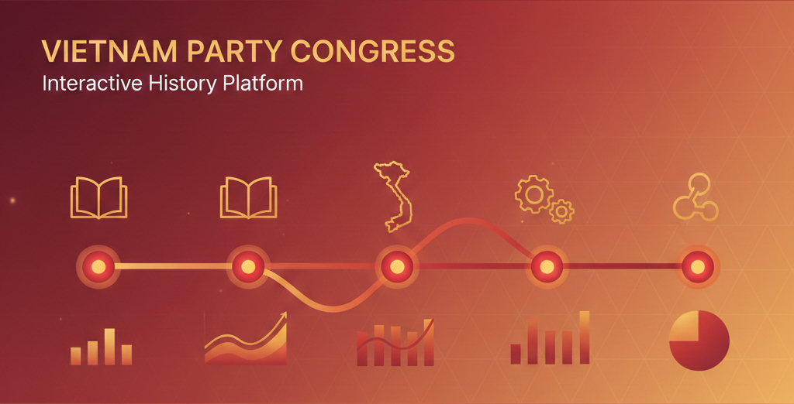

# Vietnam Party Congress
## Lịch sử các kỳ Đại hội Đảng Cộng sản Việt Nam

An interactive, educational web application that visualizes the history of the National Congresses of the Communist Party of Vietnam (Đại hội Đảng Cộng sản Việt Nam).  
The project serves as a digital archive, combining historical data, timelines, visual analytics, and interactive experiences to help users better understand the Party’s development from 1935 to the present.



---

## 🌟 Key Features

The application is organized into multiple interactive modules:

### 🔹 Overview (Tổng quan)
- **Interactive Timeline:**  
  A vertical timeline covering all National Congresses (I–XIV), allowing users to explore key milestones chronologically.
- **Statistical Visualization:**  
  An interactive bar chart illustrating changes in the number of delegates across different Congresses.
- **Congress Details:**  
  In-depth information for each Congress, including historical context, main themes, key resolutions, and major achievements.

### 🗺️ Map (Bản đồ)
- Displays the geographical locations where National Congresses were held (e.g., Macau, Tuyên Quang, Hà Nội).
- Helps users visualize the spatial dimension of Party history.

### 🖼️ Gallery (Thư viện)
- A multimedia archive containing historical photographs and documentary videos related to each Congress.

### 👥 Personnel (Nhân sự)
- A searchable and filterable database of Party leaders (e.g., General Secretaries).
- Supports filtering by position and historical period.

### 🎮 Trivia Challenge (Minigame)
- A gamified “Time Attack” quiz designed to test users’ knowledge of Party history, leaders, dates, and key events.

### 🧭 3D Experience
- An embedded virtual exhibition space and 3D tour to enhance engagement and immersive learning.

---

## 🛠️ Technology Stack

- **Framework:** React 19
- **Language:** TypeScript
- **Styling:** Tailwind CSS
- **Icons:** Lucide React
- **Charts:** Recharts
- **Fonts:**
    - Inter (Sans-serif)
    - Merriweather (Serif)  
      via Google Fonts

---

## 📂 Project Structure

```text
├── index.html              # Entry HTML (Tailwind CDN & Import Maps)
├── index.tsx               # React entry point
├── App.tsx                 # Main layout and tab navigation
├── types.ts                # TypeScript interfaces and models
├── data.ts                 # Static historical dataset
└── components/
    ├── Timeline.tsx        # Interactive congress timeline
    ├── CongressDetails.tsx # Detailed congress content
    ├── CongressModal.tsx   # Full-screen modal view
    ├── StatsChart.tsx      # Delegate statistics visualization
    ├── MapTab.tsx          # Congress location map
    ├── GalleryTab.tsx      # Image and video archive
    ├── QuizTab.tsx         # History quiz minigame
    └── PersonnelTab.tsx    # Leader profiles and filters
